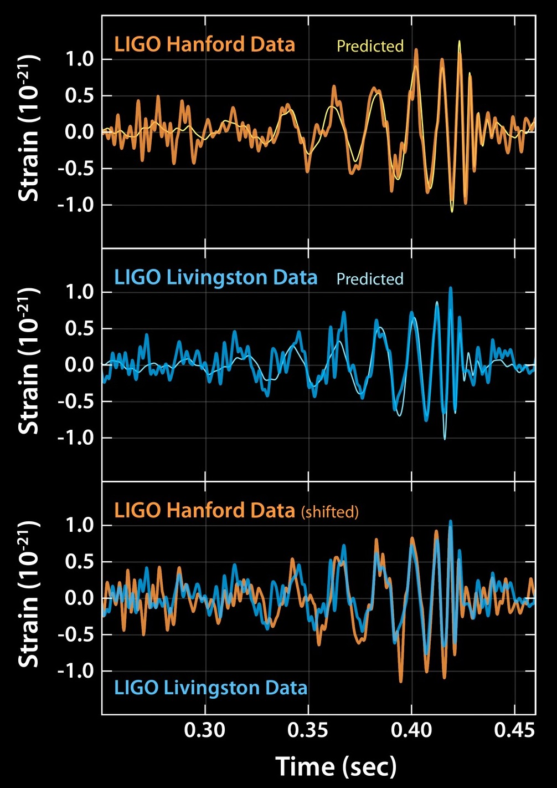
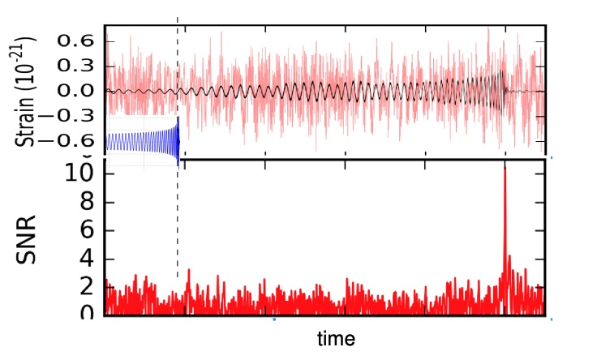
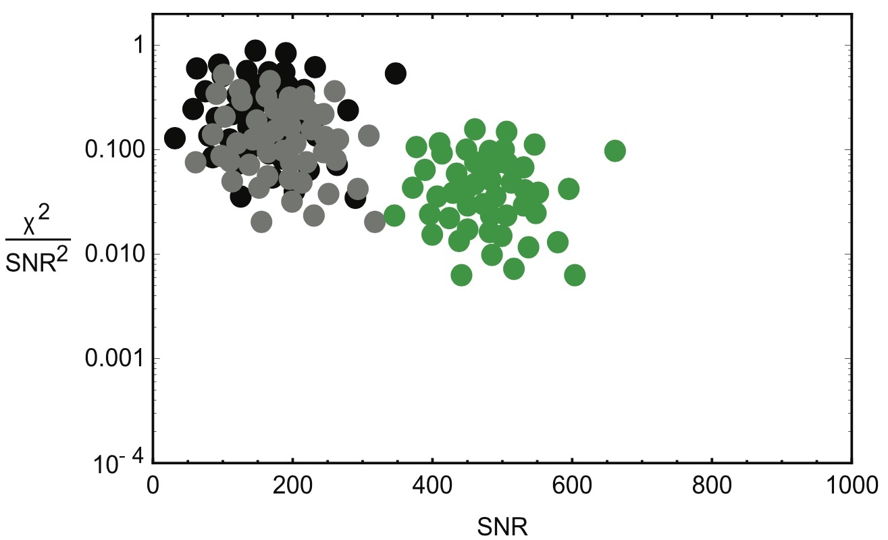
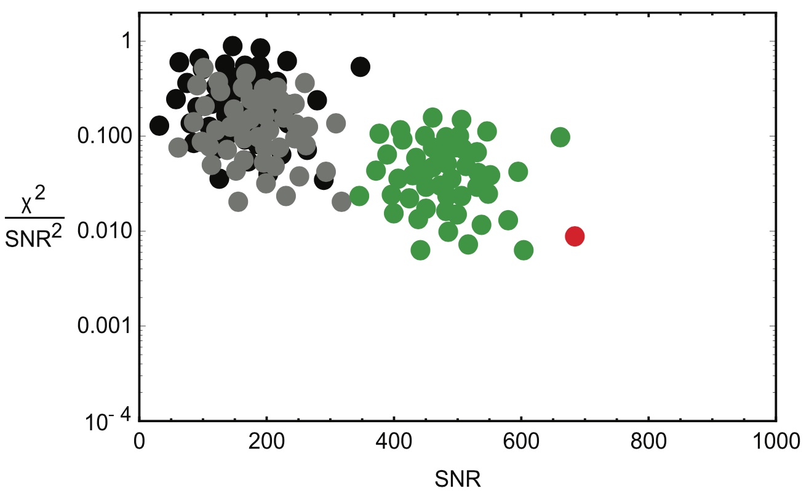

**🚧 This is a work-in-progress! 🚧**

**Unfortunately, you won’t be able to get this code running on your machine unless you install the `GstLAL` libraries and have access to the data coming off the Hanford and Livingston detectors.**

# Introduction

Welcome to my Laser Interferometer Gravitational-Wave Observatory (LIGO) project! At one time in my career, I worked with LIGO to research ways to improve the sensitivity of their gravitational wave detection-instrument.

LIGO consists of two detectors located in Hanford, Washington and Livingston, Louisiana. These detectors use lasers and mirrors to measure the extremely small changes in distance that result from the passage of a gravitational wave.

Here, I'll give an overview of my the project I worked on, providing details with little `code snippets`. However, I can't guarantee that the provided snippets will work today, since LIGO's `GstLAL` Python libraries have probably changed a lot since I did my work.

# The Detections

At the time I did my research, LIGO had already made their first direct observation of a gravitational wave, which happened on the 14th of September in 2015.

The detectors in Hanford and Livingston detected gravitational waves emanating out from merging binary black hole systems, confirming Einstein's theory of relativity in new ways.

There are three distinct stages of a black hole merger.

- **Inspiral:** For black holes with masses similar to those of the black holes detected by LIGO, the inspiral phase can last for millions or even billions of years. This is because the gravitational waves emitted during the inspiral phase are very weak, and it takes a long time for the black holes to lose enough energy and angular momentum to come into close enough proximity to merge.
- **Merger:** This is the phase during which the black holes actually collide and merge into a single black hole, is much shorter than the inspiral phase. This phase, in sharp contrast to the inspiral phase, lasts on the order of a few milliseconds to a few seconds. The merger phase is characterized by a rapid increase in the amplitude of the gravitational waves emitted by the system, as the black holes come into close proximity and collide.
- **Ringdown:** But even after the black holes in the binary system merge, they still aren't finished emitting gravitational waves. The black hole merger is super-chaotic, and represents an enormous perturbation to the system. Any perturbed system will naturally resonate at its normal mode; black holes are no different. When the binaries come together, the resulting black hole "rings" at it's "quasinormal modes" through a stage we call the ringdown.

The parameters of different binary black hole systems affect how black holes merge at all these stages, resulting in wildly different binary black hole signatures. However, generally, all these  all come together to make a gravitational wave signature that looks like this:



# The Project

The LIGO Scientific Collaboration is a sprawling scientific collaboration with many moving parts. Thousands of people since the early nineties have been working on building the detectors, and developing the technology and data processing to achieve the sensitivities required in order to detect gravitational waves.

Increasing the sensitivity of LIGO's detectors is critical because it allows scientists to detect gravitational waves from increasingly distant sources. This, in turn, allows them to study a wider range of celestial objects and phenomena, including some that may be too far away or too faint to be observed in other ways.

There are two things you can do if you want to increase sensitivity: change the detector (and its environment), or change your algorithms. I worked on the algorithm team. We were going for sensitivity increases by figuring out how to process the data in a more effective way.

# Noise, the enemy!

### Matched filtering

Because the data coming off the detector is so noisy, engineers have figured out really clever ways to filter it out. After we pass raw data through some basic normalization algorithms including things like frequency filtering and whitening, we pass the signal through a "Matched Filtering" algorithm.

This Matched Filtering algorithm works by convolving the gravitational wave model over the data to calculate a signal-to-noise ratio (SNR) as the model moves along the SNR graph. When a potential gravitational wave signal is detected, it is added to the pool of candidates. A signal is identified as a spike in signal-to-noise ratio (SNR).

These spikes are relatively common, and most of them end up not being gravitational wave signals. In order to narrow our pool of candidates for further investigation, we execute the following procedure on our pool of SNR-spike candidates.

1. Calculate $\chi^2$
2. Compare the SNR with the other detector to see if they had a spike within light-travel time of our spike

We calculate $\chi^2$. A low $\chi^2$ means that the trigger is a good fit to the GW template. Triggers that only appear in one of the LIGO instruments are assumed to be noise, while triggers that appear in both detectors within a light travel time are considered GW candidates. If these two tests pass, we have ourselves a candidate!



### Binning & probability density functions

Let’s say that the signal passes all these tests. We can’t call it a detection yet. It needs to clear an even higher bar. In order to call it a detection, we need to calculate the $\sigma$ value, meaning the changes of it being a false positive are close to zero. For example, the first detection had a $\sigma$ value of 5.1, which means that the chances of it being a coincidence were extremely low, with such an event likely to be seen in both detectors once every 200,000 years i.e. one in 4.6 million.

Different waveform shapes are affected by noise differently. For example, if the gravitational waveform has sharper, narrower peaks in amplitude, it may be more easily triggered by noise in the detector, since the noise may be concentrated in a particular frequency band that coincides with the peaks. If the waveform we’re looking at is smoother with wider peaks, it may be more easily distinguished from noise, since the noise is more likely to be spread out over a wider range of frequencies. This is just an example.

We  density of noise-generated triggers from a single detector and three wave shapes in the black, grey, and green dots. Over time, clusters form in the locations based on the characteristic and common noise sources from that detector, that geographic area, etc. The clusters are in different locations because for each waveform shape, there are different values of $\mathrm{SNR}^2$ and $\chi^2$ that constitute anomalies worth further investigation.

As these clusters corresponding to different wave shapes resolve with more and more points, we fit probability density functions (PDFs) to them. However, when we do a search in GstLAL, we estimate the characteristics of the background noise for similar waveforms by binning the search’s template bank—grouping similar waveforms together. We then calculate the background of the entire bin and apply it to each waveform in the bin.

Ideally, the background noise characteristics should be calculated individually for each waveform, but the statistics are not large enough, so we need to bin. To better resolve the tails of these distributions, we combine noise triggers from similar templates together when constructing the denominator of L. (This is shown in Fig. 1 as black + grey dots).

How do we determine this false-positive likelihood given all this variation? One of the techniques we use is to form a probability distribution using a combination of both $\chi^2$ and $\frac{\chi^2}{\mathrm{SNR}^2}$…



If a gravitational wave candidate falls within the populated area of its waveform PDF, it is likely just a false alarm. If the candidate falls outside of a main cluster, the noise pattern is categorically different, and there are better chances that the candidate was an actual gravitational wave detection. 

We can capture this relationship with the Likelihood ($\mathcal{L}$), a metric that captures the probability that a given combination of signal-to-noise-ratio squared ($\mathrm{SNR}^2$) and $\chi^2$ values was produced by a gravitational wave signal rather than noise. The likelihood is defined as the ratio of the probability density function (PDF) of the data given the signal hypothesis, to the PDF of the data given the noise hypothesis, with the PDFs evaluated at the observed data:

$$
\mathcal{L} = \frac{\rho_\mathrm{d},\chi^2_\mathrm{d} | \theta, \mathrm{signal}}{\rho_\mathrm{d},\chi^2_\mathrm{d} | \theta, \mathrm{noise}}
$$

- $\rho_\mathrm{d}$ and $\chi^2_\mathrm{d}$ are the SNR and $\chi^2$ values for a given waveform shape in a specific cluster
- $\theta$ represents the parameters that define the PDFs for the noise and signal distributions
- The numerator is the probability that this combination of SNR and $\chi^2$ was produced by a signal, and the denominator is the probability that it was produced by noise.

The PDF in the denominator is constructed by using the density of noise-generated triggers from each detector. The numerator represents the probability that the observed SNR and $\chi^2$ values were produced by a gravitational wave signal given the PDF parameters and assuming a signal is present. We divide the numerator and denominator in the likelihood formula because we want to compare the relative probability that the observed SNR and $\chi^2$ values were produced by a gravitational wave signal versus noise.

If the likelihood is high, then the observed data is more likely to have been produced by a gravitational wave signal than by noise alone. Conversely, if the likelihood is low, then the observed data is more likely to have been produced by noise alone than by a gravitational wave signal.

### Binning

When you do a search in GstLAL, you estimate the characteristics of the background noise by binning the search’s template bank, calculating the background of the entire bin and applying it to each template in the bin. Ideally, the background noise characteristics should be calculated individually for each template, but the statistics are not large enough, so we need to bin

Since there are no black noise triggers in its vicinity, it is very difficult to calculate its statistical significance. To better resolve the tails of these distributions, we combine noise triggers from similar templates together when constructing the denominator of L. (This is shown in Fig. 1 as black + grey dots).

This all comes to life in the figure below, where we plot a GW candidate in red.



### My Job

The quality of these bins is an important part of selecting high-quality candidates.

There are a lot of moving parts at LIGO, so in this project, we will focus on my work on gravitational waveform "classification," or "binning"!

But what is binning with respect to gravitational wave detection?

The binning was done in different ways at the time and on physical parameters, like mass/spin or duration, but I thought we could come up with a better strategy that optimized the likeness of templates within each bin. My thinking was that this would improve sensitivity.  However, our initial findings were actually quite surprising. We found that a random binning actually improves the sensitivity the most.  I still think we discovered a flaw in the group’s thinking about template binning, which is that you should bin to optimize sensitivity.  I think instead we need to recognize that the background estimate assumes templates within a given bin are similar, and if they are not, then you can end up with artificially boosted sensitivities.

Also, I think we found that walktrap "worked" best.

# Code

Over the course of my time at LIGO, I developed a number of subroutines called and orchestrated by a central shell script. This shell script 

`GstLAL` is a software package developed by the LIGO Scientific Collaboration (LSC) used to analyze data from LIGO's gravitational wave detectors.

One of the main uses of `GstLAL` is to compare the data off the detector to how we'd expect gravitational waveforms to show up on the detector, and looking for matches or correlations between the two.

`GstLAL` includes a number of tools and algorithms that are specifically designed to optimize the search for gravitational waves. For example, it includes tools for generating theoretical templates, for filtering and conditioning the data, and for calculating statistical significance.

# The Matching Algorithm

### Parallelization using Python’s `optparse.OptionParser()` and Bash

To identify natural clusters in the waveforms, we had to determine the degree of similarity between each pair of waveforms in our set. Essentially, we needed to compare every waveform in our set to every other waveform and assign each pair a "similarity score." We accomplished this using the `InspiralSBankComputeMatch()` function, which returns a floating-point number between 0 and 1 that represents the degree of similarity between two waveforms.

We can represent the resulting relationships with a complete graph as seen below. In this image, each node represents a waveform template, and each edge represents its similarity to another waveform template.


As we add more and more waveforms (nodes) to this complete graph, we get a combinatorial explosion; the number of necessary comparisons between waveform templates (edges) increases by $\frac{n(n-1)}{2}$. In computational complexity terms, that’s $n^2$, which isn’t great, especially when we’re dealing with thousands of nodes. There isn’t really a quick way around this though. Since we’re prioritizing accuracy, and don’t have to run this routine constantly, we didn’t focus on optimizing the number of calculations or comparisons in our routine.

We were, however, running both the matching and binning algorithms on computing clusters with around 50 cores. When I ran the matching algorithm without any parallelization, it took an entire weekend to finish. Since we were running highly parallelizable jobs, we wanted to take advantage of the raw computing power available to reduce the time between match jobs so we could develop and iterate faster.

I wrote `generate_matches.py` to be highly serial; there was a set sequence that the algorithm would run through in order to compare each waveform to every other waveform. Since we knew the sequence of comparisons that the algorithm would run through ahead of time, we could just divide the sequences that would run separately on each core.

To divide the workload, I created a shell script that calculates the total number of comparisons required, which is equivalent to the number of edges in the complete graph.

```bash
numCores=$2
numberEdges=$(( $1 * ($1 - 1)/2 ))
binSize=$(( $numberEdges / $2 ))
```

The script then uses the number of edges in the complete graph to determine how many cores to use for processing. It checks for the largest divisor of the number of edges that matches the number of cores specified in the command line argument.

```bash
# Find number of cores to use based on number of edges,
# ensuring that the number of edges is evenly divisible
# by the number of cores
for i in `seq $2 0`
do
        if [ $inumberEdges % $i -eq 0 ]  
        then $numCores=$i
        fi
done

# Check to ensure divisibility
ifIt=$(($numberEdges % $numCores))
mult=$(($numberEdges / $numCores))
if let '$ifIt != 0'; then
        exit
fi

# Print to screen
echo '* * * * * * * *' 
echo 'Will use $i cores'
echo '* * * * * * * *' 
printf "\n \n"
```

Though we may leave a couple cores out of the calculation this way, it’s a way to keep the code and the subroutine simple to ensure each core has the same number of jobs to perform.

After we’ve determined the number of threads to create, we run a for loop to launch all the Python scripts. We use a for loop with a few variables include `$numCores`, `$binSize`, `start` and `end` to divide up the jobs and instruct the scripts which part of the graph to tackle.

```bash
for i in `seq 1 $numCores`
do
        start=$(( ($i - 1) * $binSize))
        end=$(($i * $binSize))
        ./generate_matches.py -n $1 -f $start -t $end &
done
echo 'generate_matches.py complete'
```

### So, how does `generate_matches.py` actually work?

We pass a few parameters to the `generage_matches.py`, with the following flags:

- `-n`, the number of templates
- `-f`, the template number to start matching
- `-t`, the template number to end matching

It is necessary to provide each script with the total number of templates in the bank. This is because each script must work off the same master list of edges. (`edge_list = igraph.Graph.Full(numTemplates)`) Although they are provided with different start and stop indices to iterate through these lists, they must line up properly, as we intend to merge them as if they were all generated together later on.

We can take a look under the hood of these scripts to see how the flags interact with the programs.

```python
# PARSER OPTIONS * * * * * * * * * * * * * * * * * *
# Initialize the option parser
parser = optparse.OptionParser()

# Indicate number of waveforms in the template bank .xml file
parser.add_option("-n", "--number", dest="numTemplates", type=int,
                  help="Assign number of waveforms to generate and \
									inspect to NUM", metavar="NUM", default=10)

# A flag to let the program know which waveform in the list to start
# generating from
parser.add_option("-f", "--from", dest="generateFrom", type=int,
                  help="Start generating at the Nth waveform \
									(inclusive)", metavar="N")

# A flag to let the program know which waveform in the list to end
# generating
parser.add_option("-t", "--to", dest="generateTo", type=int,
                  help="Stop generating at the Nth waveform \
									(exclusive)", metavar="N")

# Ingest options
generateFrom = options.__dict__['generateFrom']
generateTo = options.__dict__['generateTo']
(options, args) = parser.parse_args()
# * * * * * * * * * * * * * * * * * * * * * * * * *
```

We use `InspiralSBankComputeMatch()` to compare templates neighboring templates (nodes). As I mentioned briefly above, we have ensure that each `generate_matches.py` is on the same page.

Why is this so important though? We need to create a list that everyone can work off of in order to merge the work later. The size and shape of the complete graph represented in list form changes pretty dramatically

Therefore, we pass the number of templates into each python instance, generate the complete edge list with `edge_list = igraph.Graph.Full(numTemplates)`, and then

```bash
# Create list of edge relations
print "Creating graph edges..."
edge_list = igraph.Graph.Full(numTemplates)

# Create list of edge relations
print "Creating graph edges..."
edge_list = igraph.Graph.Full(numTemplates)

# This writes an edge list
print "Writing .ncol of graph edges..."
edge_list.write("./edge_lists/edge_list_%s.ncol" % str(numTemplates), format='ncol')
```

I’d probably have done the above differently if I were writing this program today. I can see some ways that 50 different scripts writing and reading files with the same name to the operating systems at basically the same time to the same place could cause some problems. Fortunately, we never had any issues the way this was written.

After we read the edge array back in, we allocate ourselves…

```bash
edge_array = edge_array[generateFrom:generateTo]
```

### Prepare waveforms for comparison

In order to make accurate comparisons, we need to treat the waveforms

The square of the standard deviation of Gaussian noise is equal to the integral of the PSD over all frequencies. Therefore, the variable name "sigmasq" is a convenient and recognizable way to denote the PSD.

```bash
for q in range(r, 2):
	# Pack up waveform into a freq. series usable by match function
	new[q] = CreateCOMPLEX8FrequencySeries(fs[q].name,
																				 fs[q].epoch,
																				 fs[q].f0,
																				 fs[q].deltaF,
																				 fs[q].sampleUnits,
																				 fs[q].data.length)
	
	# Create a copy of the frequency series
	new[q].data.data[:] = fs[q].data.data[:]
	
	# Whiten the copy using the ASD
	new[q].data.data /= ASD
	
	# Normalize the waveform using the ASD and PSD of the freq-domain series
	sigmasq[q] = float(np.vdot(new[q].data.data,
										 new[q].data.data).real * 4 * 1. / duration)
	new[q].data.data /= sigmasq[q] ** 0.5
```

### Calculate matches between waveforms

If we inspect iGraph’s documentation, their `.ncol` format works like this:

```
...
10 18 0.85159153964
10 19 0.838519020742
11 12 0.994238606918
11 13 0.978512742562
11 14 0.958788907317
11 15 0.937414268629
...
```

It’s a very simple format where, on each line, the nodes are referenced in the first two.

```bash
# Calculate match of each waveform with one another
target.write('%s %s %s' % (str(index[int(edge_array[current][0])]),
													 str(index[int(edge_array[current][1])]),
                           str(InspiralSBankComputeMatch(
															 new[0], new[1], workspace_cache))))
```

```python
# Create list of edge relations
print "Creating graph edges..."
edge_list = igraph.Graph.Full(numTemplates)

print "Writing .ncol of graph edges..."
# This writes an edge list!
edge_list.write("./edge_lists/edge_list_%s.ncol" % str(numTemplates), format='ncol')

# This loads the edge list from the exported file
# of the form:
# [[0,1], [0, 2]... [2,3], [3,4]]
print "Loading edge list..."
edge_array = np.loadtxt("./edge_lists/edge_list_%s.ncol" % str(numTemplates))
edge_array = edge_array[generateFrom:generateTo]
# ...
```

Then we would…

```python
for current in range(len(edge_array)):
	# ... generate comparison ...
```

```python
# PARSER OPTIONS * * * * * * * * * * * * * * * * * *
# Initialize the option parser
parser = optparse.OptionParser()

# Indicate number of waveforms in the template bank .xml file
parser.add_option("-n", "--number", dest="numTemplates", type=int,
                  help="Assign number of waveforms to generate and \
									inspect to NUM", metavar="NUM", default=10)

# A flag to let the program know which waveform in the list to start
# generating from
parser.add_option("-f", "--from", dest="generateFrom", type=int,
                  help="Start generating at the Nth waveform \
									(inclusive)", metavar="N")

# A flag to let the program know which waveform in the list to end
# generating
parser.add_option("-t", "--to", dest="generateTo", type=int,
                  help="Stop generating at the Nth waveform \
									(exclusive)", metavar="N")

# Ingest options
generateFrom = options.__dict__['generateFrom']
generateTo = options.__dict__['generateTo']
(options, args) = parser.parse_args()
# * * * * * * * * * * * * * * * * * * * * * * * * *
```

This parallelization cut the time it took to run from >48 hours to about 45 minutes. We could run the code, check for bugs, check for increased sensitivities, and then re-run with tweaked parameters much faster after that.

In our `automate_matching.sh` bash file, we can see how we feed options to the 

```bash
clear
echo '* * * * * * * * * * * *'
echo Will generate and analyze complete relations between $1 waveforms using $2 cores
echo '* * * * * * * * * * * *' 
printf "\n \n"

numCores=$2
numberEdges=$(( $1 * ($1 - 1)/2 ))
binSize=$(( $numberEdges / $2 ))

for i in `seq $2 0`
do
        if [ $inumberEdges % $i -eq 0 ]  
        then $numCores= $i
        fi
done

echo '* * * * * * * *' 
echo 'Will use $i cores'
echo '* * * * * * * *' 
printf "\n \n"

ifIt=$(($numberEdges % $numCores))
mult=$(($numberEdges / $numCores))

if let '$ifIt != 0'; then
        exit
fi

for i in `seq 1 $numCores`
do
        start=$(( ($i - 1) * $binSize))
        end=$(($i * $binSize))
        ./old_matching.py -n $1 -f $start -t $end &
done

echo 'generate_matches.py complete'
```

## The Binning Algorithm

```bash
clear
echo '* * * * * * * * * * * * * * * * * * * * * * * * * * * * * * * * * * * * * * * *'
echo 'Will generate and analyze complete relations between $1 waveforms using $2 cores'
echo '* * * * * * * * * * * * * * * * * * * * * * * * * * * * * * * * * * * * * * * *' 
printf "\n \n"

numCores=$2
numberEdges=$(( $1 * ($1 - 1)/2 ))
binSize=$(( $numberEdges / $2 ))

for i in `seq $2 0`
do
        if [ $inumberEdges % $i -eq 0 ]  
        then $numCores= $i
        fi
done

echo '* * * * * * * *' 
echo 'Will use $i cores'
echo '* * * * * * * *' 
printf "\n \n"

ifIt=$(($numberEdges % $numCores))
mult=$(($numberEdges / $numCores))

if let '$ifIt != 0'; then
        exit
fi

for i in `seq 1 $numCores`
do
        start=$(( ($i - 1) * $binSize))
        end=$(($i * $binSize))
        ./generate_matches.py -n $1 -f $start -t $end &
done

echo 'generate_matches.py complete'
```

# Binning

Waveform binning is a technique used to group gravitational waveforms into categories or "bins" based on certain characteristics, which can improve the efficiency of gravitational wave searches, and increase instrument sensitivity (or so we thought).

# The Code