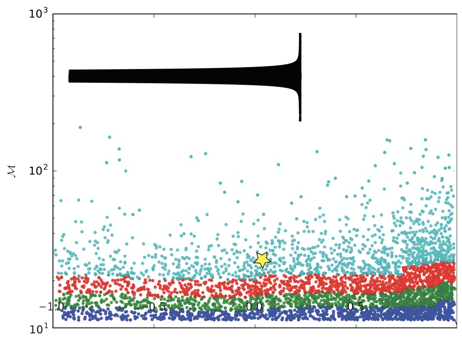

# Intro To LIGO

### This Document

Welcome to my Laser Interferometer Gravitational-Wave Observatory (LIGO) project, where I outline my work with LIGO to research ways to improve the sensitivity of their gravitational wave detection-instrument.

One quick note: I can't guarantee that the provided snippets will work today, since LIGO's `LAL` Python libraries are always evolving, and this codebase is separate from LIGO’s main codebase.

### The Detections

LIGO consists of two detectors located in Hanford, Washington and Livingston, Louisiana. These detectors use lasers and mirrors to measure the extremely small changes in distance that result from the passage of gravitational waves.

LIGO made this first detection on September 14, 2015: the detectors in Hanford and Livingston picked up gravitational waves emanating from a merging binary black hole system 1.4±0.6 billion light years away, confirming Einstein's theory of relativity in new ways.

### Anatomy of A Black Hole Merger

There are three distinct stages of a black hole merger.

- **Inspiral:** For black holes with masses similar to those of the black holes detected by LIGO, the inspiral phase can last for millions or even billions of years. The gravitational waves emitted during the inspiral phase are very weak, and it takes a long time for the black holes to lose enough energy and angular momentum to come into close enough proximity to merge.
- **Merger:** This is the phase during which the black holes actually collide and merge into a single black hole. At this point, there’s a rapid increase in the amplitude of the signal as the black holes come into close proximity and collide. This phase, in sharp contrast to the inspiral phase, lasts on the order of a few seconds to milliseconds.
- **Ringdown:** But even after the black holes in the binary system merge, they still aren't finished emitting gravitational waves. The black hole merger is super-chaotic, and represents an enormous perturbation to the system. Any perturbed system will naturally resonate at its normal mode; black holes are no different. When the binaries come together, the resulting black hole "rings" at it's "quasinormal modes" through a stage we call the ringdown.

The parameters of different binary black hole systems affect how black holes merge at all these stages, resulting in wildly different binary black hole signatures. However, generally, all these  all come together to make a gravitational wave signature that looks like this…

<p align="center">
	
</p>

# The Theory

The LIGO Scientific Collaboration is a sprawling, with many moving parts. Thousands of people since the early nineties have been working on building the detectors, and developing the technology and data processing to achieve the sensitivities required in order to detect gravitational waves.

Increasing the sensitivity of LIGO's detectors is a big part of what these scientists and engineers have been working towards. Increasing sensitivity allows scientists to detect gravitational waves from increasingly distant sources, increasing the relative likelihood that a signal will be found.

There are two things you can do if you want to increase sensitivity: change the detector (and its environment), or change your algorithms. I worked on an algorithm team. We were going for sensitivity increases by figuring out how to process the data in more effective ways.

### Overcoming Noise w/ Matched Filtering

Because the data coming off the detector is so noisy, engineers have figured out really clever ways to clean it up. After we pass raw data through some basic normalization algorithms including things like frequency filtering and whitening, we pass the signal through a "Matched Filtering" algorithm.

This Matched Filtering algorithm works by convolving the gravitational wave model over the data to calculate a signal-to-noise ratio (SNR) as the model moves along the SNR graph. A signal is identified as a distinct pattern in signal-to-noise ratio (SNR) that looks like this:


<p align="center">
	
</p>

So let’s add some artificial noise...

<p align="center">
	
</p>

And then run our convolution SNR calculation...

<p align="center">
	
</p>

Even with noise added, there’s a distinct shape that emerges in the SNR data. However, fools gold is also possible. There are also spikes in the data that result in SNR that looks a lot like the SNR from a detection to the untrained eye.

<p align="center">
	
</p>

[All images from Les Wade, Kenyon College Department of Physics.]

These spikes are relatively common, and most of them end up not being gravitational wave signals. In order to narrow our pool of candidates for further investigation, we also calculate $\chi^2$ for each candidate. A low $\chi^2$ means that the trigger is a good fit to the GW template. However, at this stage, there are still relatively many signals that score reasonably well, with a high peak-SNR, and low $\chi^2$.

### Forming Probability Density Functions (PDFs) with SNR  and $\chi^2$

In order to narrow our list of candidates even more, we calculate the $\sigma$ value for each to determine the likelihood that each is a false positive. A high $\sigma$ value indicates a low chance of a false positive and therefore, a high level of confidence. For instance, the first true detection that LIGO made had a $\sigma = 5.1$ which means the chance of it being a coincidence was extremely low, with such an event likely to be seen in both detectors once every 200,000 years, or one in 4.6 million. Let’s discuss how we calculate $\sigma$ for each candidate detection.

The first step to plot of all the candidate detections with SNR on the x-axis and $\chi^2/\mathrm{SNR^2}$ on the y-axis. A cluster forms in this space as more detection candidates accrue. The location of the cluster within the space is based on the characteristic noise sources from the detector, the geographic area, the shape of the waveform template, etc.

<p align="center">
	
</p>

Once we have a cluster, we will assume that all of the candidates in the cluster are actually just false-positives from noise, and can start to form a probability density function (PDF) of false-positives. If we see a gravitational wave candidate outside of the main cluster, we can assign a probability that corresponds to seeing a signature that looks like that outside of the normal cluster.

<p align="center">
	
</p>

The only problem with this strategy: there aren’t enough candidate detections corresponding to a single waveform to form a robust PDF for that waveform. We need a lot of noise samples to really build out a good idea of what kinds of areas of the graph we expect these blips to appear. So, we solve that problem by binning like waveforms together when forming PDFs.

Let’s plot another, very similar waveform’s noise PDF on top of the first’s above…

<p align="center">
	
</p>

Because the waveforms are very similar, but slightly different in shape, the clusters are centered on very similar, but slightly different locations. The clusters are in different locations because for each waveform template shape, there are different values of $\mathrm{SNR}^2$ and $\chi^2$ that constitute anomalies worth further investigation. In other words, noise interacts with different waveforms differently.

### Why We Bin

Ideally, the background noise characteristics should be calculated individually for each waveform, but the statistics are not large enough. To better resolve the tails of these distributions, we combine noise triggers from similar templates together when constructing PDFs. In other words, we bin similar waveforms together to form more robust PDFs.

But we have to ensure that the bins are well-made. The waveforms that form the black and grey dots were affected by noise in similar ways, producing very similar clusters. We can expect that a a combined PDF would be sound. However, if we combine the black and grey clusters with the green cluster below, we might see a reduction in sensitivity. 

<p align="center">
	
</p>

When trying to detect gravitational waves, it's important to use the right "bins" for noise signature clusters in order to enhance LIGO's signal sensitivity. If a gravitational wave candidate falls within the populated area of its waveform PDF, it's probably just a false alarm. However, if the candidate falls outside of a main cluster, it's more likely to be a real gravitational wave detection.

Let's say the black, grey, and green clusters are all within the same bin, and we generate a single PDF to represent the combined noise. If a candidate originates from one of these clusters, and the binning isn't great with too much variation, we could miss signals. In the diagram, a potential signal that should be far from the grey waveform's ideal PDF is instead within the green PDF, which mistakenly assigns it a higher probability of being a false alarm.

<p align="center">
	
</p>

### The Likelihood ($\mathcal{L}$)

We can capture this relationship with a single metric, Likelihood ($\mathcal{L}$), which captures the probability that a given combination of signal-to-noise-ratio squared ($\mathrm{SNR}^2$) and $\chi^2$ values was produced by a gravitational wave signal rather than noise. The likelihood is defined as the ratio of the probability density function (PDF) of the data given the signal hypothesis, to the PDF of the data given the noise hypothesis, with the PDFs evaluated at the observed data:

$$
\mathcal{L} = \frac{\rho_\mathrm{d},\chi^2_\mathrm{d} | \theta, \mathrm{signal}}{\rho_\mathrm{d},\chi^2_\mathrm{d} | \theta, \mathrm{noise}}
$$

- $\rho_\mathrm{d},\chi^2_\mathrm{d}$ taken together is the probability returned by the PDF given the SNR and $\chi^2$ inputs.
    - $\rho_\mathrm{d}$ is the measured Signal-to-Noise Ratio (SNR) of the candidate event.
    - $\chi^2_\mathrm{d}$ is the chi-square statistic for the candidate event.
- $\theta$ is the set of parameters that characterize the waveform or the signal model, which can include the masses, spins, and orientations of the binary system in a gravitational wave event.
- $\mathrm{signal}$ is the hypothesis that the candidate event is a gravitational wave signal.
- $\mathrm{noise}$ is the hypothesis that the candidate event is due to noise in the detector.

The PDF used in the denominator is constructed by using the density of noise-generated triggers from each detector. The numerator represents the probability that the observed SNR and $\chi^2$ values were produced by a gravitational wave signal given the PDF parameters and assuming a signal is present. We divide the numerator and denominator in the likelihood formula because we want to compare the relative probability that the observed SNR and $\chi^2$ values were produced by a gravitational wave signal versus noise.

If the likelihood is high, then the observed data is more likely to have been produced by a gravitational wave signal than by noise alone. Conversely, if the likelihood is low, then the observed data is more likely to have been produced by noise alone than by a gravitational wave signal.

If the gravitational wave is sufficiently far out of the PDF—we have a high likelihood—at which point, we compare the candidate with the other detector to see if they had a candidate signal within light-travel time of our signal. If they match up, the possibility that this is a real detection goes up drastically.

Very few candidates make it this far, but for the ones that do, we start taking a very close look at the signal, using slower and more advanced techniques to calculate a final $\sigma$ value.

### What The Bins Actually Look Like

And here’s what the bins actually look like on a graph of all the waveforms where the y-axis is chirp mass ($\mathcal{M}$) and the x-axis is mass ratio of the binary system ($\mathcal{Q}$).

<p align="center">
	
</p>

This graph above shows **default binning** by chirp mass ($\mathcal{M}$) only. The image of the waveform corresponds to the waveform at the starred location.

$\mathcal{M}$, the chirp mass, is a metric that takes both masses in the binary system and calculates a single, mass-dimension quantity that encapsulates the whole system’s mass. Chirp mass is given by the following equation.

$$
\mathcal{M} = (m_1m_2)^{3/5} \times(m_1+m_2)^{-1/5}
$$

$\mathcal{Q}$, the mass ratio of the binary system, given by the following equation.

$$
\mathcal{Q} = m_1/m^2
$$

As I mention above, the old binning scheme was very crude, calculating a chirp mass for each waveform, ordering the list based on chirp masses, and then dividing the list evenly into same-sized bins. The default binning scheme resulted the graph with simple, horizontally-divided bins. Could we find better ways to bin that would generate better PDFs, and in-turn, increase sensitivity? Let’s dive into the code that made it happen.

# The Matching Algorithm

### Parallelization using Python’s `optparse.OptionParser()` and Bash

To identify natural clusters in the waveforms, we had to determine the degree of similarity between each pair of waveforms in our set. Essentially, we needed to compare every waveform in our set to every other waveform and assign each pair a "similarity score." We accomplished this using the `InspiralSBankComputeMatch()`, a `LAL` function that returns a floating-point number between 0 and 1 that represents the degree of similarity between two waveforms.

We can represent the resulting relationships with a complete graph as seen below. In this image, each node represents a waveform template, and each edge represents its similarity to another waveform template.

<p align="center">
	
</p>

As we added more and more waveforms (nodes) to this complete graph, we got a combinatorial explosion; the number of necessary comparisons between waveform templates (edges) increased by $\frac{n(n-1)}{2}$. That’s a time complexity of $\mathcal{O}(n^2)$, which isn’t great, especially when we were dealing with thousands of nodes. There wasn’t  really a quick way around this though. Since we were prioritizing accuracy, and didn’t have the time to optimize, we didn’t focus on optimizing the number of calculations or comparisons in our routine.

We were, however, running both the matching and binning algorithms on computing clusters with around 50 cores. When I ran the matching algorithm without any parallelization, it took an entire weekend to finish. Since we were running highly parallelizable jobs, we wanted to take advantage of the raw computing power available to reduce the time between match jobs so we could develop and iterate faster.

I wrote `generate_matches.py` to be highly serial; there was a set sequence that the algorithm would run through in order to compare each waveform to every other waveform. Since we knew the sequence of comparisons that the algorithm would run through ahead of time, we could just divide the sequences that would run into batches that would run separately on each core.

To divide the workload, I created a shell script that calculated the total number of comparisons required, which was equivalent to the number of edges in the complete graph.

```bash
numCores=$2
numberEdges=$(( $1 * ($1 - 1)/2 ))
binSize=$(( $numberEdges / $2 ))
```

The script then used the number of edges in the complete graph to determine how many cores to use for processing. It checked for the largest divisor of the number of edges that matches the number of cores specified in the command line argument.

```bash
# Finds number of cores to use based on number of edges,
# ensuring that the number of edges is evenly divisible
# by the number of cores
for i in `seq $2 0`
do
        if [ $inumberEdges % $i -eq 0 ]  
        then $numCores=$i
        fi
done

# Checks to ensure divisibility
ifIt=$(($numberEdges % $numCores))
mult=$(($numberEdges / $numCores))
if let '$ifIt != 0'; then
        exit
fi

# Prints to screen
echo '* * * * * * * *' 
echo 'Will use $i cores'
echo '* * * * * * * *' 
printf "\n \n"
```

Though we may leave a couple cores out of the calculation this way, it was a way to keep the code and the subroutine simple to ensure each core has the same number of jobs to perform.

This parallelization cut the time it took to run from more than 45 hours to about 45 minutes. We could run the code, check for bugs, check for increased sensitivities, and then re-run with tweaked parameters much faster after that.

After we’d determined the number of threads to create, we ran a for loop to launch all the Python scripts. We used a `for` loop with a few variables include `$numCores`, `$binSize`, `start` and `end` to divide up the jobs and instruct the scripts which part of the graph to tackle.

```bash
for i in `seq 1 $numCores`
do
        start=$(( ($i - 1) * $binSize))
        end=$(($i * $binSize))
        ./generate_matches.py -n $1 -f $start -t $end &
done
echo 'generate_matches.py complete'
```

It was necessary to provide each script with the total number of templates in the bank; each script had to work off the same list of edges (`edge_list = igraph.Graph.Full(numTemplates)`). The instances of the script were provided with different start and stop indices to iterate through these lists, but had to line up perfectly, as we intended to merge them later on.

We passed a few parameters to the `generage_matches.py`, with the following flags:

- `-n`, the number of templates
- `-f`, the template number to start matching
- `-t`, the template number to end matching

We can take a look under the hood of these scripts to see how the flags interacted with the scripts.

```python
# Initializes the option parser
parser = optparse.OptionParser()

# Indicates number of waveforms in the template bank .xml file
parser.add_option("-n", "--number", dest="numTemplates", type=int,
                  help="Assign number of waveforms to generate and \
                  inspect to NUM", metavar="NUM", default=10)

# A flag to let the program know which waveform in the list to start
# generating from
parser.add_option("-f", "--from", dest="generateFrom", type=int,
                  help="Start generating at the Nth waveform \
                  (inclusive)", metavar="N")

# A flag to let the program know which waveform in the list to end
# generating
parser.add_option("-t", "--to", dest="generateTo", type=int,
                  help="Stop generating at the Nth waveform \
                  (exclusive)", metavar="N")

# Ingests options
generateFrom = options.__dict__['generateFrom']
generateTo = options.__dict__['generateTo']
(options, args) = parser.parse_args()
```

### Creating A List of Edges That Aligned For All Threads

The size and shape of the complete graph represented in list form changed pretty dramatically as the number of nodes changed, so we needed to create a list that everyone could work off of in order to merge the work later.

So we passed the number of templates into each script instance, and generated the complete edge list with `edge_list = igraph.Graph.Full(numTemplates)`.

```python
# Creates list of edge relations
print "Creating graph edges..."
edge_list = igraph.Graph.Full(numTemplates)

# Creates list of edge relations
print "Creating graph edges..."
edge_list = igraph.Graph.Full(numTemplates)

# Writes an edge list
print "Writing .ncol of graph edges..."
edge_list.write("./edge_lists/edge_list_%s.ncol" % str(numTemplates), format='ncol')
```

(I’d probably have done the above differently if I were writing this program today. I can see some ways that 50 different scripts writing and reading files with the same name to the operating systems at basically the same time to the same place could cause some problems. Fortunately, we never had any issues the way this was written.)

With the code above, we basically generated a list of all the edges in a complete graph given a certain number of nodes. Each item in the list we generated corresponded to an edge: the black lines in this visual.

<p align="center">
	
</p>

As mentioned above, as I increased the number of nodes in the complete graph, the number of edges went up by $\frac{n(n-1)}{2}$. In this case, the number of nodes in our graph was `numTemplates`, the number of waveform templates in our template bank.

The text representation of the complete graph looked like this…

```python
0 1
0 2
0 3
...
0 15
0 16
0 17
...
1 11
1 12
1 13
...
2 14
2 15
2 16
```

In this scheme, each of the numbers corresponded to a waveform template i.e. `0`, `14`, `2` all corresponded to waveform templates with those IDs. Each *pair* of numbers corresponded to an edge between two waveform templates i.e. `0 17`, `1 12`, and `2 14` are all edges that represented similarity between two waveform templates.

After we generated the list of edges that corresponded to the number of waveform templates we had in our template bank, we focued in on just that part of the list that has been assigned to us.

```python
edge_array = edge_array[generateFrom:generateTo]
```

### Sorting The Waveform Templates By Duration

To keep everything neat, we decided to reorder the waveforms based on their duration. This meant that waveform `0` corresponded to the shortest waveform, waveform `1` corresponded to the second-shortest waveform, and so on. Calculating waveform duration hardly took any time at all, as it didn’t require numerical calculation. It was a simple formula that used parameters like mass and spin, corresponding to the bodies that would generate each template waveform.

First, we declared some arrays and variables we planned on using in our duration calculation and sorting...

```python
# Declares the array we are going to be using in match calculation
fs = [0, 0]
sigmasq = [0, 0]
new = [0, 0]
hplus = [0, 0]
hcross = [0, 0]

# Vars for duration calculation
fmin = 20.0
chi = 0

# Declares tracking indices
durArr = []
countArr = []
```

Then we calculated the duration for each template waveform…

```python
for t in range(numTemplates):
    # Duration calculation takes in only masses and spins
    chi = lalsim.SimIMRPhenomBComputeChi(
        template_bank[t].mass1,  # Mass 1
        template_bank[t].mass2,  # Mass 2
        template_bank[t].spin1z,  # Spin 1 Z
        template_bank[t].spin2z  # Sping 2 Z
    )
    dur = 1.1 * lalsim.SimIMRSEOBNRv2ChirpTimeSingleSpin(
    	template_bank[t].mass1 * lal.MSUN_SI,
        template_bank[t].mass2 * lal.MSUN_SI,
        chi,
        fmin)
    
    durArr.append(dur)
    countArr.append(t)
```

Next, we performed non-destructive re-ordering with an array `index` whose entries contained the waveform IDs, ordered by waveform duration. So, for example, in `index = [6, 45, 87, 31, 21, 47]`, waveform `6` was the shortest in duration, waveform `45` was the second-shortest duration, waveform `87` was the third-shortest in duration, and so on. We kept the originals just in case we needed to reference them later.

```python
# Sorts countArr using values from durArr
index = [x for (y, x) in sorted(zip(durArr, countArr))]

print "Generating duration list..."
print "Waveform 0 is shortest, with ascending order..."

# Prints out each waveform ID, and it's duration starting with the shortest
for m in range(len(index)):
    print "For waveform # %s, (originally # %s)" % (str(m),
					str(index[m])), " ,the duration is %s" % str(durArr[index[m]])
```

### Matching The Waveforms: Saving Some Time

A reminder that our edge list looked like this…

```python
...
3 24
3 25
3 26
3 27
3 28
3 29
4 5
4 6
4 7
...
```

Notice that it’s ordered pretty conveniently: edges were given as nested lists, where the first integer was fixed as it moves through all its edges corresponding to that node. To save time calculating the waveforms (one of the most expensive computations we do), we only generated the first waveform once. As we moved down the list with the same first index, we only re-generated the waveform that corresponded to the second index.

Here’s how I implemented that time-saving measure. It got the job done!

```python
for current in range(len(edge_array)):

    before = int(edge_array[current][0])
    after = int(edge_array[current][0])

    if current != 0:
        before = int(edge_array[current - 1][0])

    if (before == after and current != 0):
    	r = 1
		# print "Not generating another template [0]"
    else:
        r = 0
		# print "Generating a new template [0]"

    for q in range(r, 2):
        # ... COMPARE WAVEFORMS ...
```

We did end up saving a lot of time, but we were still doing duplicate work on the order of $\frac{n(n+1)}{2}$, where $n$ was the number of templates. The time complexity of this problem was $\mathcal{O}(n^2)$, which isn’t great. We could have eliminate this extra work by storing each waveform, but decided this solution was acceptable and to work on the research itself instead of dedicating time to these kinds of optimizations.

The following `for` loop is in the `for` loop above, and the `lalsim.SimInspiralFD()` function takes in many arguments that represent waveform parameters.

```python
for q in range(r, 2):
        # Loads current waveform
        hplus, hcross = lalsim.SimInspiralFD(
            0.,  # Phase
            1.0 / duration,  # Sampling interval
            1.e6 * lal.PC_SI,  # distance
	          # ... WAY MORE PARAMS ...
                                             )
```

This waveform generation function is built into the `LAL` library, so I didn’t need to know how it worked. As far as I knew, it took in binary system parameters, and output the frequency-domain gravitational-wave strain signal produced by the inspiral, merger, and ringdown phases of the binary system coalescence.

### What The Generated Waveforms Look Like

If we converted the frequency series generated in the step above into waveforms before they were converted into frequency series, this is what they looked like. (I know it's not the best render, but it’s what I have!)

<p align="center">
	
</p>

After we had the frequency-domain signal for the system, we performed some additional data prep, including conversion to a [complex frequency series](https://lscsoft.docs.ligo.org/lalsuite/lal/struct_c_o_m_p_l_e_x8_frequency_series.html), whitening, and other normalization. All this made the waveform more useable for the match function.

```python
# Converts to a complex frequency series
new[q] = CreateCOMPLEX8FrequencySeries(fs[q].name,
                                       fs[q].epoch,
                                       fs[q].f0,
                                       fs[q].deltaF,
                                       fs[q].sampleUnits,
                                       fs[q].data.length
                                       )

# ... MORE CLEANING ...

# FS: Whitens waveform
new[q].data.data /= ASD

# FS: Normalizes waveform
sigmasq[q] = float(np.vdot(new[q].data.data, new[q].data.data).real * 4 * 1. / duration)
new[q].data.data /= sigmasq[q] ** 0.5

# Calculates match of each waveform with one another
# and writes to file on disk
target.write('%s %s %s' % (str(index[int(edge_array[current][0])]),
                           str(index[int(edge_array[current][1])]),
                           str(InspiralSBankComputeMatch(new[0],
                                                         new[1],
                                                         workspace_cache
                                                         )
                            )
                            )
             )
```

### Taking Time

The comparison and matching we did above didn’t actually take up that much time; generating the waveform shapes based on binary system parameters did though. In order to time these operations, I saved the a time before the computation started each time with `start_time = time.time()`. At the end of the script, I outputed the difference between start and end times with with `(time.time() - start_time))`.

After all the scripts are done running, we ran our victory lap…

```bash
echo 'generate_matches.py complete'
```

# Binning The Template Waveforms

Now that we had calculated all the similarities of all the waveforms to all the other waveforms, it was time to begin grouping them. The task was simple: find bins of waveforms that optimized instrument sensitivity. But how would we know if our bins were effective? Well, to be honest, figuring out how to test the bins wasn’t my job. The collaboration had other people working on that. The way we tested our bins was to send them off to another group, who would inject simulated wave signals into simulated noise, and measure how many of the waveforms the algorithm with the new bins picked up.

Here’s what we got back from sensitivity estimation group whenever we’d send our bins. The x-axis shows Combined FAR (False Alarm Rate) in Hertz, and the y-axis shows the range of origination of the signal. The smaller the FAR at a given range, the more sensitive we can call the instrument. There were three lines, each corresponding to different ranges of $M_\odot$, or solar mass.

<p align="center">
	
</p>

So, we had a very clear ask (to find the optimal bins), and a very clear way to measure results (send the bins off and receive a score).

### Finding A New Way To Bin

This was where I was able to use some of my creativity, where the real experimentation came in. What was the best way to cluster complete graphs based on edge weights? My first experiment on day-one was to plug in some dummy numbers into Mathematica. Mathematica had some interesting graph clustering functions including `FindGraphCommunities[]` and `CommunityGraphPlot[]` for visualizing it.

---

<p align="center">
	
</p>

Source: [Mathematica CommunityGraphPlot[] Documentation](https://reference.wolfram.com/language/ref/CommunityGraphPlot.html) & my archives

---

After experimenting with some of Mathematica's built-in functions on smaller datasets, we found that it produced results that loosely aligned to our intuitions about which waveforms should appear in which clusters. However, Mathematica didn’t allow much flexibility in defining the number of clusters, and the algorithm they used to cluster was a black-box. We tried to reach out to the Wolfram Research team, to no avail. Transparency in this research was critical, and we couldn’t be using opaque, closed-source tools in this open-source scientific project.

Another practical issue we ran into was that when we tried to execute Mathematica’s clustering algorithms on our full dataset with thousands of waveforms and millions of edge weights, the program slowed to a crawl. One time, we left the algorithm running over a weekend, and came back to a still-running Mathematica kernel. 😩

We needed a different way, so we turned to Python’s `igraph` library.

### The Binning Algorithm Wars

Embedded in the complete graph we had created, were two types of information, both scalar quantities: 1.) We had edge weights, which were floating-point values from 0–1 that indicated the similarity between any two waveforms. 2.) We had a duration value, given in seconds, for each of our waveforms.

After some careful study of [how clustering algorithms worked](https://arxiv.org/abs/physics/0512106), we resolved to try two approaches, with each approach corresponding to one of these data types. The first clustering algorithm we implemented would use only duration to cluster, and the second would use the edge weights, or the relationships between all the waveforms to cluster.

### An Algorithm To Bin By Duration

This was a relatively simple algorithm. It basically worked in the following way:

1. Find the shortest duration waveform that hasn’t been put into a bin already.
2. Find the `n` most similar neighbors based on edge weights, and put them into a bin.
3. Repeat step 1. and 2. until all the waveforms are in a bin.

Like `generate_matches.py`, we took in options that ask how many waveforms to generate and how many bins to split the template bank into…

```python
parser = optparse.OptionParser()
parser.add_option("-n", "--number", dest="numNodes", type=int,
                  help="assign number of waveforms to generate and inspect to NUM", metavar="NUM")
parser.add_option("-b", "--bins", dest="numBins", type=int,
                  help="Select the size of the bins to use, assigns to NUM", metavar="NUM")
(options, args) = parser.parse_args()
```

We then took in a text file that represented the complete graph with its edge weights to create an `igraph` graph object `g`, which we operated on from here-on-out. 

```python
# Creates an igraph graph object with 'g'
g = igraph.Graph.Read_Ncol("./waveform_complete_graphs/all_%u/all.txt" % numNodes)
```

There is a lot of housekeeping and setup that we had to conduct before the algorithm actually did any binning. But then we’ll skip to the exciting part: the binning!

A more comprehensive overview of how this algorithm chose bins is linked [here](https://mermaid-js.github.io/mermaid-live-editor/edit#pako:eNptlN1u4jAQhV_F8jWgBGhZuFiJQktpgf7Q3Yt1uDCJAYvEjmxntxTx7juehIWltRQpHn9nPHPsZE9jnQjao2vD8w15G0aqz-aOG7cg9fp3csMmWufEbYwu1huiimwGvF1EyhbLUrPShqQemoSRIjBuUDlgYyWd5Kn8EIQbw3eWcJWQVFrn9Z4cIDncv5kdcZqsJKznRmYc5r-FceL9UIJDAMlPjBClHexZAFqH4C2bb2Xu1Uq8OyKdMNxJrRafhSfRHRsJBwK53iy1sUSvLrat1HdY34j1rZVrdcEQbonVhYlFRY-Qvr9wrNoERTIWx9a_sK9Zrvhxj6nG7M47AqexhnKPu0JEJOvjpn6MkX5g_TwX__gaUjXk__ginDepPIgz7QNqH_eDjYi3RK4IT9MzZ3KjoWYrkuogIH_58uiNnWojzmDIX_GlE2dk_-useBoTNtfmU3_HO7PcVeVXRU8w95TNRSpi31NO4C0TypX3KzaCO0GW8ngFpiiYsYFOUVHtk_KlSC3af2JnyD6xH3nikzSHfs2WpQCC3T8h83zhmP8q_nPr-WQQrl2Yc1MR_c9iXH9hQ2gLajiFz27QCzKv7NlI5bBGCL5i8FYlDB6Y0xrNhMm4TOD73vsGI-o2YFVEe_CacLONaKQOwPHC6flOxbTnTCFqtMD-h5LDHc1ob8VTC9Gcq19aZ0cIprS3p--0Vw-_hY0gCJrNzlW722mF3VaN7iDebTU6rWuYXoXhdbvTbR9q9ANTNBvtoN1pB-FVGASdVjMAhUik02Za_pDwv3T4C7NBfHs), but here’s a simplified version:


All of this happened in a two-layer nested `for` loop. Here’s the basic structure.

```python
for counter in range(numNodes):
	# Loops through nodes
	for counter1 in range(neighborList:)
		# Loops through neighbors of that node
```

In that first loop above, `for counter in range(numNodes):`, we had the following. This routine 1.) set the next vertex we’re going to look at based on the next vertex in the counter, 2.) found that vertex’s neighbors, which returned a list of vertex objects and then 3.) assigned those neighbors to a list…

```python
for counter in range(numNodes):
	# Sets the new vertex of interest
    # if primaryVertex doesn't exist,
    # we skip the iteration
    try:
        primaryVertex = g.vs.find(label='%s' % str(index[counter]))
    except ValueError:
        continue

	# Assigns the source vertex
    source = primaryVertex

    # Finds the list of neighbors of our
	# primary vertex
    neighborList = primaryVertex.neighbors()
```

The code in the nested `for` loop created a list of edge objects connected to `source`, and a separate list of their scalar weights…

```python
for counter1 in neighborList:
    # Finds the target node
    target = g.vs.find(label='%s' % counter1['label'])

    # Appends the target to 'vertexObjArr'.
    vertexObjArr.append(target)

    # Finds the edge between 'source' and 'target'
    try:
        neighborEdge = g.es.find(_source=source.index, _target=target.index)
    except ValueError:
        neighborEdge = g.es.find(_source=target.index, _target=source.index)

    # Appends the edge between source and target to 'neighborObjArr'
    neighborObjArr.append(neighborEdge)

    # Appends the weight of the edge to 'weightNumArr'
    weightNumArr.append(neighborEdge['weight'])
```

Then, we were back in the original `for` loop, so we sorted the list of vertex objects connected to the source node based on the weight of their connection to the source vertex…

```python
# Sorts neighborObjArr using values from weightNumArr
sortedEdgeArr = [x for (y, x) in sorted(zip(weightNumArr, neighborObjArr))]

# Sorts vertexObjArr using values from weightNumArr
sortedVertexArr = [x for (y, x) in sorted(zip(weightNumArr, vertexObjArr))]
```

And finally, created our bin, using the `source` vertex and the top `selectTop` most similar vertices based on their similarity to the `source` vertex.

```python
# Selects the bottom 'selectTop' elements of 'sortedVertexArr'
to_bin = sortedVertexArr[len(sortedVertexArr) - (selectTop - 1):]

# Adds the source vertex to the beginning of the bin.
to_bin.insert(0, source)

# Collects all the templates labels to go to a single bin into an array
for x in range(len(to_bin)):
    aBin.append(to_bin[x]['label'])

```

We then collected all the vertices to go into the new into an array and append the array to a 2D array of bins. Finally, the vertices in the new bin were deleted from the graph, and we restarted the process….

```python
# Appends the array to a 2D array of bins
bins.append(aBin)

# Local clean up
aBin = []
g.delete_vertices(to_bin)
to_bin = []
```

After we had all the bins ready to go in the 2D array `bins`, we could create the plots.

```python
# Creates two copies of the bins that
# correspond to the binary mass of object 1
# and the binary mass of object 2 for
# each template
corM1 = copy.deepcopy(bins)
corM2 = copy.deepcopy(bins)

# Sets masses equal to corresponding indices
# in the 
for x in range(len(bins)):
    for y in range(len(bins[x])):
        corM1[x][y] = template_bank[int(bins[x][y])].mass1
        corM2[x][y] = template_bank[int(bins[x][y])].mass2

# ... Plots calculations ...

plt.savefig('./bin_plots/%s_bin_plot.png' % str(len(bins)), dpi=1000)
plt.close()
```

We found that sensitivity increased slightly, but wanted to see if we could do better, so we tried a different method of binning based on the edge weights.

### The Walktrap Algorithm

Developing this next algorithm was a lot simpler from my standpoint because we used algorithms that had already been written, and that were present in the `igraph` library.

We tried out a few different algorithms, including `community_walktrap()`, `community_fastgreedy()`, and `community_multilevel()`, but found that walktrap worked best. All these algorithms ignored any information associated with the nodes like duration, and just used the weight of the edges (similarity values) between nodes to find clusters. I will again, skip a bunch of setup, and just dive into the nitty-gritty of how it works.

First, we imported the graph…

```python
# Set 'g' equal to an undirected igraph graph object
print "Importing graph..."
g = igraph.Graph.Read_Ncol("./waveform_complete_graphs/all_%s/all.txt" % (str(numNodes)), directed=False)
```

Then, we defined our `steps` parameter, ran the algorithm, and printed the results, all in just three lines of code. Wow! That was easy!

```python
# The walktrap algorithm
com5 = g.community_walktrap(weights='weight', steps=4)
print(com5.as_clustering(n))
com5AsClustering = com5.as_clustering(n)
```

Then we set up the data structures to plot…

```python
toPlot = igraph.plot(com5.as_clustering(n), bbox=[2000,2000], vertex_color=[color_list[x] for x in com5AsClustering.membership])
toPlot.save(plots_directory + '/walktrap_bin_by_weight_%s_graph.png' % str(len(list(com5AsClustering))))
```

And finally, plotted using the same subroutine we used in the last algorithm, discussed above, with a bit more formatting…

```python
# Plotting...
corM1 = copy.deepcopy(list(com5AsClustering))
corM2 = copy.deepcopy(list(com5AsClustering))
for x in range(len(com5AsClustering)):
        for y in range(len(com5AsClustering[x])):
                corM1[x][y] = template_bank[int(com5AsClustering[x][y])].mass1
                print "corM1:", corM1[x][y]
                print "template_bank M1:", template_bank[int(com5AsClustering[x][y])].mass1
                print " "

                corM2[x][y] = template_bank[int(com5AsClustering[x][y])].mass2
                print "corM2:", corM2[x][y]
                print "template_bank M2:", template_bank[int(com5AsClustering[x][y])].mass2
                print " "

# ... More plotting calculations ...

plt.savefig(plots_directory + '/walktrap_bin_by_weight_%s_plot.png' % str(len(list(com5AsClustering))), dpi=1000)
plt.close()
```

Here’s the plot we got from the data. It’s a bit different, with different sized buckets, and a different shape, cutting more diagonally this time.

<p align="center">
	
</p>

**Our optimized bins** take into account qualitative similarity of each template to every other template. After testing, we found that `community_walktrap()` worked best.

# Summary of Results

We thought of an interesting way to visualize the quality of the bins: within each bin, what was the minimum match between any two clusters? You can see below that by this metric, the first algorithm seems to have done better. However, this proved to be a poor proxy for how the bins would affect sensitivity.

<p align="center">
	
	
</p>

The graphs below are what we got returned from the group that tested the effectiveness of our bins. If you take a look at the three graphs below, you’ll be able to see (if you squint really hard) that the walktrap algorithm was the best. The algorithm seems to have improved the  $M_{\mathrm{total}} \in [416.67–600] M_\odot$ range the most.

**Original**

<p align="center">
	
</p>

**Walktrap, duration**

<p align="center">
	
	
</p>

A more rigorous analysis revealed ~5% sensitivity gains resulting from the following clustering algorithms...
- In the $M_{\mathrm{total}} \in [416.67–600] M_\odot$ and $M_{\mathrm{total}} \in [233.33–416.67] M_\odot$, the entire bandwidth improved in the range of 3–5% with the bin-by-duration algorithm.
- In the $M_{\mathrm{total}} \in [50–233.33] M_\odot$ range, we saw that walktrap was most effective, with improvements in the upper ranges especially on the order of ~5%.

# Future Work

- Incorporate both the duration (proxy for similarity) and edge weight in the clusters.
- Consider using the Louvain method for community detection, available in the igraph library. This method optimizes a modularity score, which measures the quality of the partition of the graph into communities.
- Test whether the Louvain method can create bins that are more homogeneous than the other methods we tried.
- Explore whether optimizing for Louvain homogeneity could make a difference.
- Document how we tested instrument sensitivity.

# References & Further Reading

- Messic, Cody *et al.* ****[Analysis Framework for the Prompt Discovery of Compact Binary Mergers in Gravitational-wave Data](https://arxiv.org/abs/1604.04324)****
- Pons, Pascal, and Matthieu Latapy. ****[Computing communities in large networks using random walks](https://arxiv.org/abs/physics/0512106)****